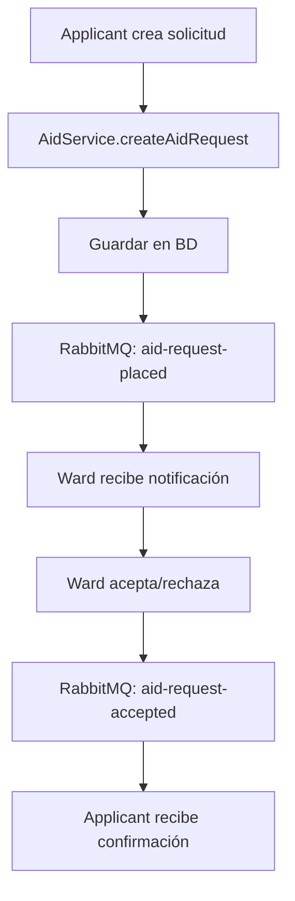

# Ward Backend API

Una API REST desarrollada con NestJS para un sistema de gestión de ayuda comunitaria que conecta solicitantes de ayuda con voluntarios (wards) a través de un sistema de mensajería asíncrona con RabbitMQ.

## 📋 Descripción

Ward Backend API es un sistema que permite:
- **Solicitantes (Applicants)**: Pueden registrarse, solicitar ayuda y gestionar sus peticiones
- **Voluntarios (Wards)**: Pueden registrarse, ofrecer servicios y responder a solicitudes de ayuda
- **Sistema de mensajería**: Utiliza RabbitMQ para el procesamiento asíncrono de solicitudes de ayuda
- **Autenticación segura**: JWT con hash de contraseñas usando bcrypt y salt

## 🛠️ Stack Tecnológico

### Framework Principal
- **NestJS 10.x** - Framework de Node.js para aplicaciones escalables
- **TypeScript** - Lenguaje de programación tipado
- **Node.js 22** - Runtime de JavaScript

### Base de Datos
- **PostgreSQL** - Base de datos relacional principal
- **TypeORM** - ORM para TypeScript y JavaScript

### Mensajería Asíncrona
- **RabbitMQ 3** - Message broker para comunicación asíncrona
- **AMQP** - Protocolo de mensajería avanzada

### Autenticación y Seguridad
- **JWT (JSON Web Tokens)** - Autenticación stateless
- **bcrypt** - Hash de contraseñas con salt
- **Guards y Decorators** - Sistema de autorización basado en roles

### Validación y Transformación
- **class-validator** - Validación de DTOs
- **class-transformer** - Transformación de objetos

### Contenedorización
- **Docker** - Contenedorización de la aplicación
- **Docker Compose** - Orquestación de servicios

## 🏗️ Arquitectura del Sistema

### Módulos Principales

#### 1. **AuthModule**
- Manejo de autenticación JWT
- Registro de usuarios (Ward/Applicant)
- Login y validación de tokens
- Guards para protección de rutas

#### 2. **UserModule**
- Gestión de usuarios (Ward y Applicant)
- Perfiles de usuario con servicios
- Roles y permisos

#### 3. **AidModule**
- Gestión de solicitudes de ayuda
- Estados: PENDING, ACCEPTED, REJECTED, COMPLETED
- Relaciones entre solicitantes y voluntarios

#### 4. **RabbitmqModule**
- Configuración de colas de mensajes
- Procesamiento asíncrono de solicitudes
- Dos colas principales:
  - `aid_requests_queue` - Nuevas solicitudes
  - `aid_accept_queue` - Solicitudes aceptadas

#### 5. **SecurityModule**
- Generación de salt y hash para contraseñas
- Servicios de seguridad centralizados

#### 6. **ServiceModule**
- Catálogo de servicios disponibles
- Relación many-to-many con usuarios

### Entidades de Base de Datos

#### User Entity
```typescript
- id: number (PK)
- firstName: string
- lastName: string
- email: string (unique)
- hash: string (password hash)
- salt: string (password salt)
- roles: ROLES[] (Ward/Applicant)
- services: Service[] (many-to-many)
- latitude/longitude: decimal
- address: string
- pricePerHour: number
```

#### Aid Entity
```typescript
- id: number (PK)
- service: string
- address: string
- status: AidStatus (enum)
- cost: decimal
- duration: string
- ward: User (many-to-one)
- applicant: User (many-to-one)
```

#### Service Entity
```typescript
- id: number (PK)
- tag: string
- description: string
- service_user: User[] (many-to-many)
```

## 🚀 Instalación y Configuración

### Prerrequisitos
- Node.js 22+
- Docker y Docker Compose
- PostgreSQL (si no usas Docker)
- RabbitMQ (si no usas Docker)

### Variables de Entorno
Crea un archivo `.env` con las siguientes variables:

```env
# Database
DB_HOST=localhost
DB_PORT=5432
DB_USERNAME=your_db_user
DB_PASSWORD=your_db_password
DB_DATABASE=ward_db

# JWT
JWT_SECRET=your_jwt_secret_key

# RabbitMQ
RABBITMQ_HOST=localhost
RABBITMQ_PORT=5672
RABBITMQ_USER=your_rabbitmq_user
RABBITMQ_PASSWORD=your_rabbitmq_password
```

### Instalación Local

```bash
# Clonar el repositorio
git clone <repository-url>
cd ward-backend-api

# Instalar dependencias
npm install

# Ejecutar en modo desarrollo
npm run start:dev

# Ejecutar en modo producción
npm run start:prod
```

### Instalación con Docker

```bash
# Levantar todos los servicios
docker-compose up -d

# Ver logs
docker-compose logs -f nestjs-app

# Detener servicios
docker-compose down
```

## 🔧 Scripts Disponibles

```bash
# Desarrollo
npm run start:dev      # Modo desarrollo con hot reload
npm run start:debug    # Modo debug

# Producción
npm run build          # Compilar aplicación
npm run start:prod     # Ejecutar en producción

# Testing
npm run test           # Tests unitarios
npm run test:e2e       # Tests end-to-end
npm run test:cov       # Coverage de tests

# Calidad de código
npm run lint           # ESLint
npm run format         # Prettier
```

## 🔐 Sistema de Autenticación

### Flujo de Autenticación
1. **Registro**: Los usuarios se registran como Ward o Applicant
2. **Hash de contraseña**: Se genera un salt único y se hashea la contraseña con bcrypt
3. **Login**: Validación de credenciales y generación de JWT
4. **Autorización**: Guards verifican tokens y roles en cada request

### Endpoints de Autenticación

```typescript
POST /auth/register/ward        # Registro de voluntario
POST /auth/register/applicant   # Registro de solicitante
POST /auth/login               # Login (ambos roles)
GET  /auth/me                  # Perfil del usuario autenticado
```

### Roles y Permisos
- **Ward**: Puede aceptar/rechazar solicitudes, ofrecer servicios
- **Applicant**: Puede crear solicitudes de ayuda, ver historial

## 📨 Sistema de Mensajería con RabbitMQ

### Configuración de Colas

#### Cola de Solicitudes (`aid_requests_queue`)
- **Exchange**: `request` (tipo: direct)
- **Patrón**: `aid-request-placed`
- **Propósito**: Procesar nuevas solicitudes de ayuda

#### Cola de Aceptaciones (`aid_accept_queue`)
- **Exchange**: `accept` (tipo: direct)
- **Patrón**: `aid-request-accepted`
- **Propósito**: Procesar solicitudes aceptadas

### Flujo de Mensajes



### Implementación RabbitMQ

```typescript
// Configuración del cliente
ClientsModule.registerAsync([
  {
    name: 'AID_REQUESTS_SERVICE',
    useFactory: async (configService: ConfigService) => ({
      transport: Transport.RMQ,
      options: {
        urls: [`amqp://${user}:${pass}@${host}:${port}`],
        queue: 'aid_requests_queue',
        exchange: {
          name: 'request',
          type: 'direct'
        }
      }
    })
  }
])

// Envío de mensajes
await this.rabbitRequestClient.emit('aid-request-placed', request);
```

## 🗄️ Base de Datos

### Configuración TypeORM

```typescript
TypeOrmModule.forRootAsync({
  useFactory: async (configService: ConfigService) => ({
    type: 'postgres',
    host: configService.get<string>('DB_HOST'),
    port: configService.get<number>('DB_PORT'),
    username: configService.get<string>('DB_USERNAME'),
    password: configService.get<string>('DB_PASSWORD'),
    database: configService.get<string>('DB_DATABASE'),
    entities: [Aid, User, Service],
    synchronize: true, // Solo en desarrollo
  })
})
```

### Relaciones Principales
- **User ↔ Aid**: One-to-Many (como ward y como applicant)
- **User ↔ Service**: Many-to-Many (servicios que ofrece/necesita)
- **Aid**: Estados del ciclo de vida de solicitudes

## 🐳 Docker y Despliegue

### Servicios en Docker Compose
- **nestjs-app**: Aplicación principal (puerto 3000)
- **postgres**: Base de datos (puerto 5432)
- **rabbitmq**: Message broker (puertos 5672, 15672)

### Dockerfile
```dockerfile
FROM node:22-alpine3.19
RUN apk update && apk add --no-cache postgresql-client
WORKDIR /app
COPY package*.json ./
RUN npm install
COPY . .
EXPOSE 3000
CMD ["npm", "run", "start:prod"]
```

### Comandos Docker Útiles

```bash
# Reconstruir imagen
docker-compose build nestjs-app

# Ver logs específicos
docker-compose logs rabbitmq
docker-compose logs postgres

# Acceder al contenedor
docker-compose exec nestjs-app sh

# Reiniciar servicio específico
docker-compose restart rabbitmq
```

## 🔍 API Endpoints Principales

### Gestión de Ayuda
```typescript
POST /aid/request/:wardId/:service    # Crear solicitud
GET  /aid/pending/:wardId            # Solicitudes pendientes para ward
POST /aid/accept/:aidId              # Aceptar solicitud
POST /aid/reject/:aidId              # Rechazar solicitud
POST /aid/finish/:aidId              # Marcar como completada
```

### Gestión de Usuarios
```typescript
GET  /user/wards                     # Listar voluntarios
GET  /user/profile/:id               # Perfil de usuario
PUT  /user/profile                   # Actualizar perfil
```

## 🧪 Testing

### Estructura de Tests
```bash
src/
├── **/*.spec.ts          # Tests unitarios
test/
├── **/*.e2e-spec.ts      # Tests end-to-end
└── jest-e2e.json         # Configuración E2E
```

### Ejecutar Tests
```bash
# Tests unitarios con watch
npm run test:watch

# Tests con coverage
npm run test:cov

# Tests E2E
npm run test:e2e
```

## 🚨 Manejo de Errores

### Guards Personalizados
- **AuthGuard**: Validación de JWT
- **RolesGuard**: Verificación de roles
- **Public Decorator**: Rutas públicas sin autenticación

### Validación de DTOs
```typescript
// Ejemplo de DTO con validaciones
export class RegisterAuthDto {
  @IsEmail()
  email: string;

  @IsString()
  @MinLength(6)
  password: string;

  @IsString()
  firstName: string;
}
```

## 📊 Monitoreo y Logs

### RabbitMQ Management
- **URL**: http://localhost:15672
- **Credenciales**: Configuradas en variables de entorno
- **Funciones**: Monitoreo de colas, mensajes, conexiones

### Logs de Aplicación
```typescript
// Logger integrado de NestJS
private readonly logger = new Logger(RabbitmqService.name);
this.logger.log(`Sending aid request: ${JSON.stringify(request)}`);
```

## 🔧 Configuración Avanzada

### Variables de Entorno por Ambiente

#### Desarrollo (.env.development)
```env
DB_HOST=localhost
RABBITMQ_HOST=localhost
JWT_SECRET=dev_secret_key
```

#### Producción (.env.production)
```env
DB_HOST=prod_db_host
RABBITMQ_HOST=prod_rabbitmq_host
JWT_SECRET=secure_production_key
```

### Configuración de CORS
```typescript
app.enableCors({
  origin: "*",
  methods: "GET,HEAD,PUT,PATCH,POST,DELETE,OPTIONS",
  credentials: true,
});
```

## 🤝 Contribución

1. Fork el proyecto
2. Crea una rama para tu feature (`git checkout -b feature/AmazingFeature`)
3. Commit tus cambios (`git commit -m 'Add some AmazingFeature'`)
4. Push a la rama (`git push origin feature/AmazingFeature`)
5. Abre un Pull Request

## 📝 Licencia

Este proyecto está bajo la Licencia UNLICENSED - ver el archivo [LICENSE](LICENSE) para detalles.

## 👥 Equipo de Desarrollo

- **Arquitectura**: NestJS + TypeScript
- **Base de Datos**: PostgreSQL + TypeORM
- **Mensajería**: RabbitMQ + AMQP
- **Seguridad**: JWT + bcrypt
- **Contenedores**: Docker + Docker Compose
