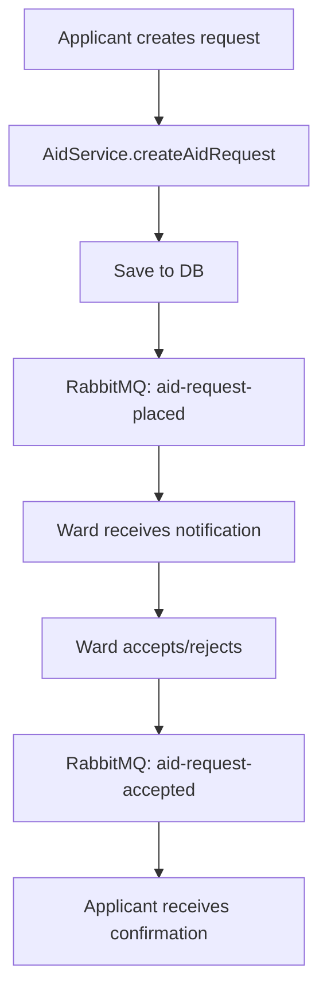

# Ward Backend API

A REST API developed with NestJS for a community aid management system that connects help seekers with volunteers (wards) through an asynchronous messaging system with RabbitMQ.

## 📋 Description

Ward Backend API is a system that enables:
- **Applicants**: Can register, request help, and manage their requests
- **Volunteers (Wards)**: Can register, offer services, and respond to help requests
- **Messaging System**: Uses RabbitMQ for asynchronous processing of aid requests
- **Secure Authentication**: JWT with password hashing using bcrypt and salt

## 🛠️ Technology Stack

### Core Framework
- **NestJS 10.x** - Node.js framework for scalable applications
- **TypeScript** - Typed programming language
- **Node.js 22** - JavaScript runtime

### Database
- **PostgreSQL** - Primary relational database
- **TypeORM** - ORM for TypeScript and JavaScript

### Asynchronous Messaging
- **RabbitMQ 3** - Message broker for asynchronous communication
- **AMQP** - Advanced Message Queuing Protocol

### Authentication & Security
- **JWT (JSON Web Tokens)** - Stateless authentication
- **bcrypt** - Password hashing with salt
- **Guards & Decorators** - Role-based authorization system

### Validation & Transformation
- **class-validator** - DTO validation
- **class-transformer** - Object transformation

### Containerization
- **Docker** - Application containerization
- **Docker Compose** - Service orchestration

## 🏗️ System Architecture

### Main Modules

#### 1. **AuthModule**
- JWT authentication handling
- User registration (Ward/Applicant)
- Login and token validation
- Guards for route protection

#### 2. **UserModule**
- User management (Ward and Applicant)
- User profiles with services
- Roles and permissions

#### 3. **AidModule**
- Aid request management
- States: PENDING, ACCEPTED, REJECTED, COMPLETED
- Relationships between applicants and volunteers

#### 4. **RabbitmqModule**
- Message queue configuration
- Asynchronous request processing
- Two main queues:
  - `aid_requests_queue` - New requests
  - `aid_accept_queue` - Accepted requests

#### 5. **SecurityModule**
- Salt and hash generation for passwords
- Centralized security services

#### 6. **ServiceModule**
- Available services catalog
- Many-to-many relationship with users

### Database Entities

#### User Entity
```typescript
- id: number (PK)
- firstName: string
- lastName: string
- email: string (unique)
- hash: string (password hash)
- salt: string (password salt)
- roles: ROLES[] (Ward/Applicant)
- services: Service[] (many-to-many)
- latitude/longitude: decimal
- address: string
- pricePerHour: number
```

#### Aid Entity
```typescript
- id: number (PK)
- service: string
- address: string
- status: AidStatus (enum)
- cost: decimal
- duration: string
- ward: User (many-to-one)
- applicant: User (many-to-one)
```

#### Service Entity
```typescript
- id: number (PK)
- tag: string
- description: string
- service_user: User[] (many-to-many)
```

## 🚀 Installation and Setup

### Prerequisites
- Node.js 22+
- Docker and Docker Compose
- PostgreSQL (if not using Docker)
- RabbitMQ (if not using Docker)

### Environment Variables
Create a `.env` file with the following variables:

```env
# Database
DB_HOST=localhost
DB_PORT=5432
DB_USERNAME=your_db_user
DB_PASSWORD=your_db_password
DB_DATABASE=ward_db

# JWT
JWT_SECRET=your_jwt_secret_key

# RabbitMQ
RABBITMQ_HOST=localhost
RABBITMQ_PORT=5672
RABBITMQ_USER=your_rabbitmq_user
RABBITMQ_PASSWORD=your_rabbitmq_password
```

### Local Installation

```bash
# Clone the repository
git clone <repository-url>
cd ward-backend-api

# Install dependencies
npm install

# Run in development mode
npm run start:dev

# Run in production mode
npm run start:prod
```

### Docker Installation

```bash
# Start all services
docker-compose up -d

# View logs
docker-compose logs -f nestjs-app

# Stop services
docker-compose down
```

## 🔧 Available Scripts

```bash
# Development
npm run start:dev      # Development mode with hot reload
npm run start:debug    # Debug mode

# Production
npm run build          # Build application
npm run start:prod     # Run in production

# Testing
npm run test           # Unit tests
npm run test:e2e       # End-to-end tests
npm run test:cov       # Test coverage

# Code Quality
npm run lint           # ESLint
npm run format         # Prettier
```

## 🔐 Authentication System

### Authentication Flow
1. **Registration**: Users register as Ward or Applicant
2. **Password Hashing**: A unique salt is generated and password is hashed with bcrypt
3. **Login**: Credential validation and JWT generation
4. **Authorization**: Guards verify tokens and roles on each request

### Authentication Endpoints

```typescript
POST /auth/register/ward        # Volunteer registration
POST /auth/register/applicant   # Applicant registration
POST /auth/login               # Login (both roles)
GET  /auth/me                  # Authenticated user profile
```

### Roles and Permissions
- **Ward**: Can accept/reject requests, offer services
- **Applicant**: Can create aid requests, view history

## 📨 RabbitMQ Messaging System

### Queue Configuration

#### Requests Queue (`aid_requests_queue`)
- **Exchange**: `request` (type: direct)
- **Pattern**: `aid-request-placed`
- **Purpose**: Process new aid requests

#### Acceptance Queue (`aid_accept_queue`)
- **Exchange**: `accept` (type: direct)
- **Pattern**: `aid-request-accepted`
- **Purpose**: Process accepted requests

### Message Flow



### RabbitMQ Implementation

```typescript
// Client configuration
ClientsModule.registerAsync([
  {
    name: 'AID_REQUESTS_SERVICE',
    useFactory: async (configService: ConfigService) => ({
      transport: Transport.RMQ,
      options: {
        urls: [`amqp://${user}:${pass}@${host}:${port}`],
        queue: 'aid_requests_queue',
        exchange: {
          name: 'request',
          type: 'direct'
        }
      }
    })
  }
])

// Message sending
await this.rabbitRequestClient.emit('aid-request-placed', request);
```

## 🗄️ Database

### TypeORM Configuration

```typescript
TypeOrmModule.forRootAsync({
  useFactory: async (configService: ConfigService) => ({
    type: 'postgres',
    host: configService.get<string>('DB_HOST'),
    port: configService.get<number>('DB_PORT'),
    username: configService.get<string>('DB_USERNAME'),
    password: configService.get<string>('DB_PASSWORD'),
    database: configService.get<string>('DB_DATABASE'),
    entities: [Aid, User, Service],
    synchronize: true, // Development only
  })
})
```

### Main Relationships
- **User ↔ Aid**: One-to-Many (as ward and as applicant)
- **User ↔ Service**: Many-to-Many (services offered/needed)
- **Aid**: Request lifecycle states

## 🐳 Docker and Deployment

### Docker Compose Services
- **nestjs-app**: Main application (port 3000)
- **postgres**: Database (port 5432)
- **rabbitmq**: Message broker (ports 5672, 15672)

### Dockerfile
```dockerfile
FROM node:22-alpine3.19
RUN apk update && apk add --no-cache postgresql-client
WORKDIR /app
COPY package*.json ./
RUN npm install
COPY . .
EXPOSE 3000
CMD ["npm", "run", "start:prod"]
```

### Useful Docker Commands

```bash
# Rebuild image
docker-compose build nestjs-app

# View specific logs
docker-compose logs rabbitmq
docker-compose logs postgres

# Access container
docker-compose exec nestjs-app sh

# Restart specific service
docker-compose restart rabbitmq
```

## 🔍 Main API Endpoints

### Aid Management
```typescript
POST /aid/request/:wardId/:service    # Create request
GET  /aid/pending/:wardId            # Pending requests for ward
POST /aid/accept/:aidId              # Accept request
POST /aid/reject/:aidId              # Reject request
POST /aid/finish/:aidId              # Mark as completed
```

### User Management
```typescript
GET  /user/wards                     # List volunteers
GET  /user/profile/:id               # User profile
PUT  /user/profile                   # Update profile
```

## 🧪 Testing

### Estructura de Tests
```bash
src/
├── **/*.spec.ts          # Tests unitarios
test/
├── **/*.e2e-spec.ts      # Tests end-to-end
└── jest-e2e.json         # Configuración E2E
```

### Ejecutar Tests
```bash
# Tests unitarios con watch
npm run test:watch

# Tests con coverage
npm run test:cov

# Tests E2E
npm run test:e2e
```

## 🚨 Manejo de Errores

### Guards Personalizados
- **AuthGuard**: Validación de JWT
- **RolesGuard**: Verificación de roles
- **Public Decorator**: Rutas públicas sin autenticación

### Validación de DTOs
```typescript
// Ejemplo de DTO con validaciones
export class RegisterAuthDto {
  @IsEmail()
  email: string;

  @IsString()
  @MinLength(6)
  password: string;

  @IsString()
  firstName: string;
}
```

## 📊 Monitoreo y Logs

### RabbitMQ Management
- **URL**: http://localhost:15672
- **Credenciales**: Configuradas en variables de entorno
- **Funciones**: Monitoreo de colas, mensajes, conexiones

### Logs de Aplicación
```typescript
// Logger integrado de NestJS
private readonly logger = new Logger(RabbitmqService.name);
this.logger.log(`Sending aid request: ${JSON.stringify(request)}`);
```

## 🔧 Configuración Avanzada

### Variables de Entorno por Ambiente

#### Desarrollo (.env.development)
```env
DB_HOST=localhost
RABBITMQ_HOST=localhost
JWT_SECRET=dev_secret_key
```

#### Producción (.env.production)
```env
DB_HOST=prod_db_host
RABBITMQ_HOST=prod_rabbitmq_host
JWT_SECRET=secure_production_key
```

### Configuración de CORS
```typescript
app.enableCors({
  origin: "*",
  methods: "GET,HEAD,PUT,PATCH,POST,DELETE,OPTIONS",
  credentials: true,
});
```

## 🤝 Contribución

1. Fork el proyecto
2. Crea una rama para tu feature (`git checkout -b feature/AmazingFeature`)
3. Commit tus cambios (`git commit -m 'Add some AmazingFeature'`)
4. Push a la rama (`git push origin feature/AmazingFeature`)
5. Abre un Pull Request

## 📝 Licencia

Este proyecto está bajo la Licencia UNLICENSED - ver el archivo [LICENSE](LICENSE) para detalles.

## 👥 Equipo de Desarrollo

- **Arquitectura**: NestJS + TypeScript
- **Base de Datos**: PostgreSQL + TypeORM
- **Mensajería**: RabbitMQ + AMQP
- **Seguridad**: JWT + bcrypt
- **Contenedores**: Docker + Docker Compose
